# 🌱 AgriStation

**AgriStation** is an offline-first Android application for real-time farm monitoring. It aggregates data from IoT sensors, tracks field health, generates alerts and tasks, and includes a Gemini-powered AI assistant that can analyze the current state of the farm and suggest concrete actions.

The project was built as a personal/portfolio Android project over **80+ hours** and focuses on practical offline-first architecture, reactive UI state, map-based field visualization, and AI-assisted decision support for agriculture.

---

## Screenshots

| Home | Fields | Field Detail |
|------|--------|--------------|
| 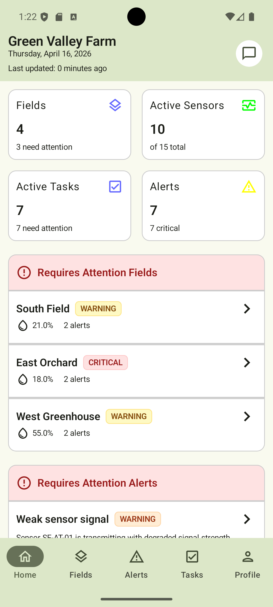 | 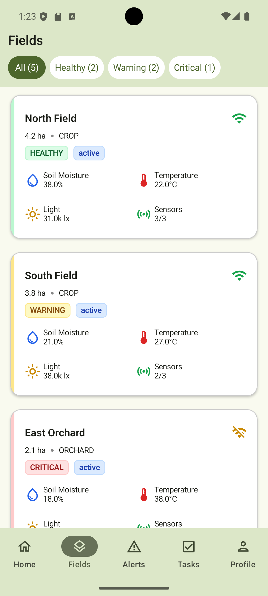 | 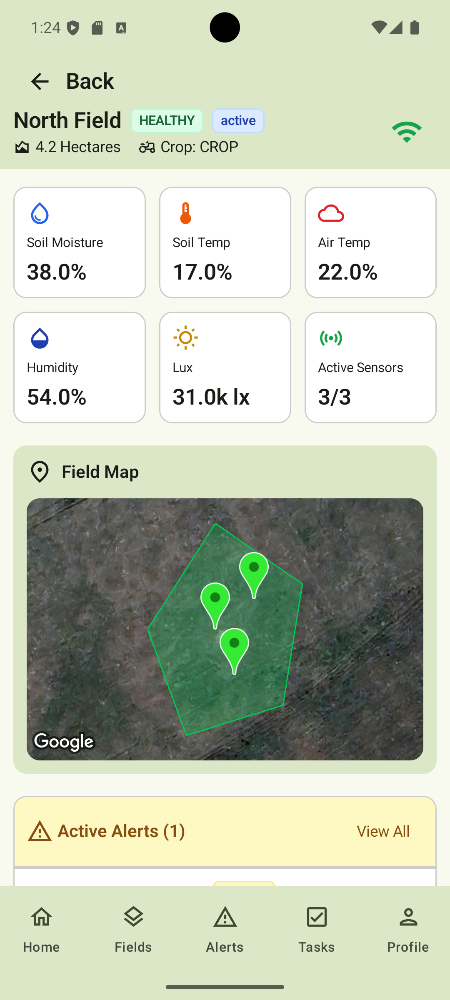 |

| Interactive Map | Statistics | AI Assistant |
|-----------------|------------|--------------|
| 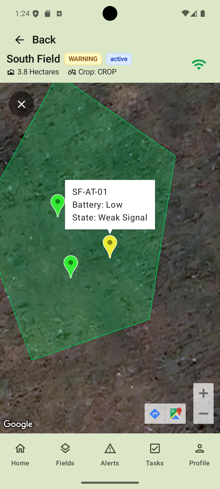 | 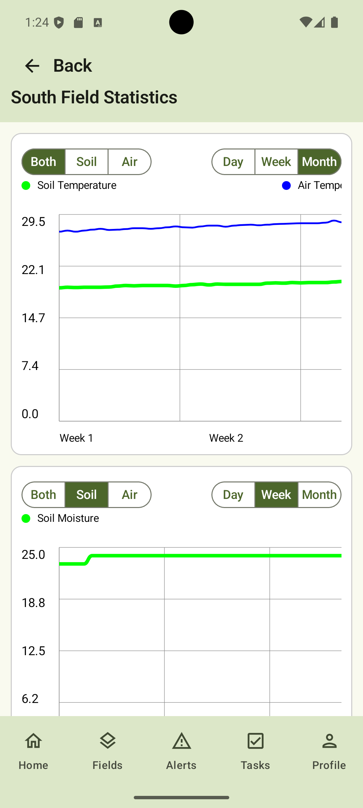 | 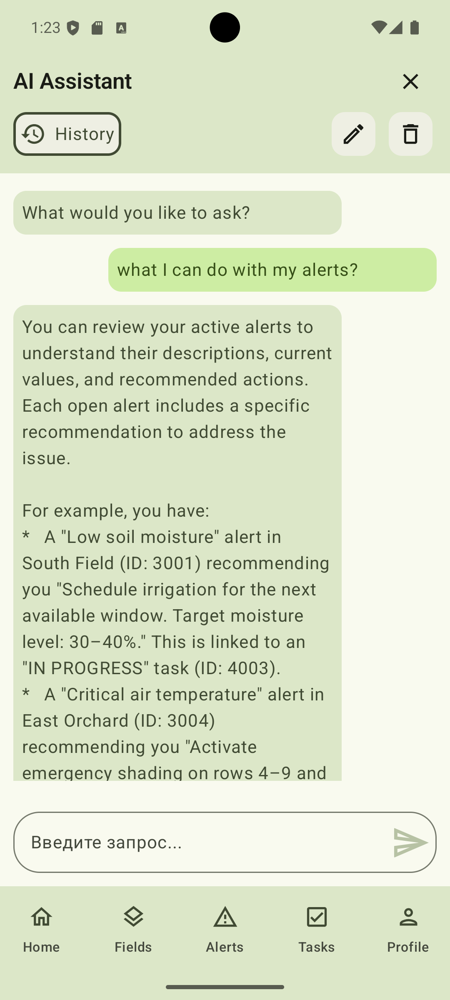 |

| Alerts | Alert Detail | Tasks |
|--------|--------------|-------|
| 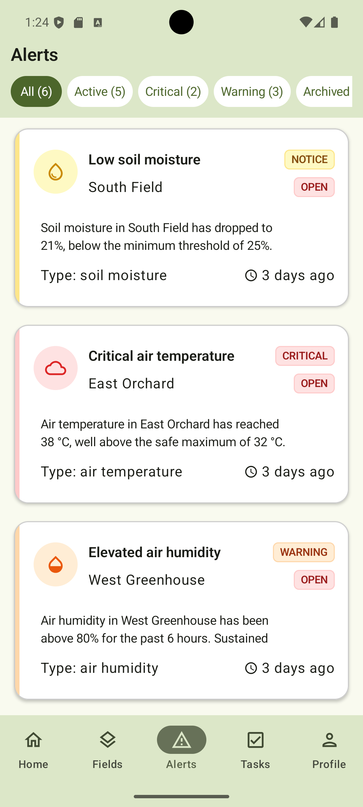 | 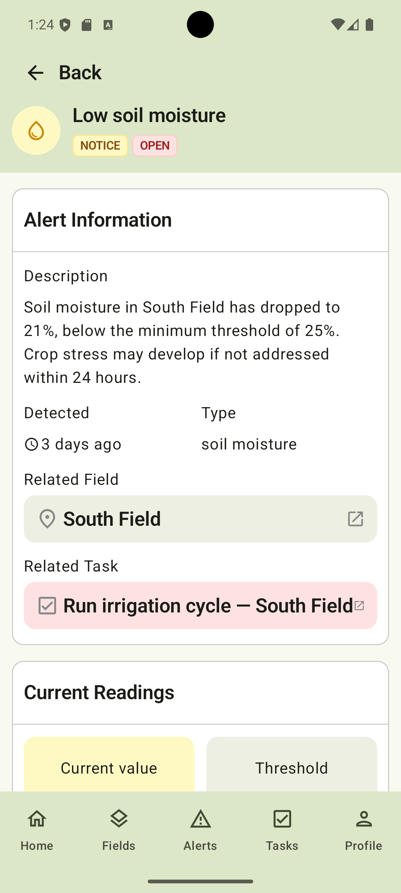 | 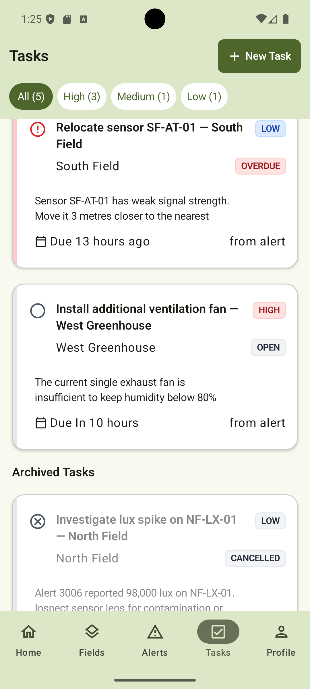 |

| Task Detail | New Task | Dark Mode |
|-------------|----------|-----------|
| 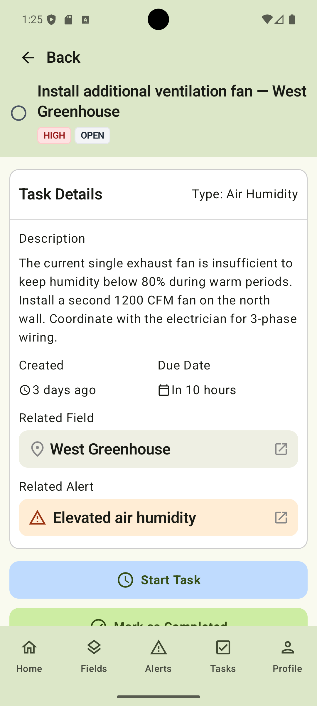 | 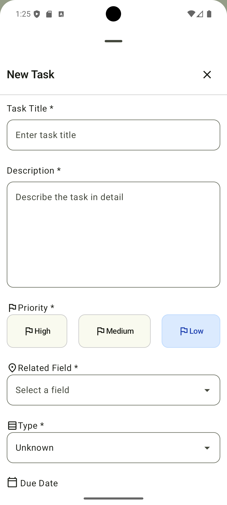 | 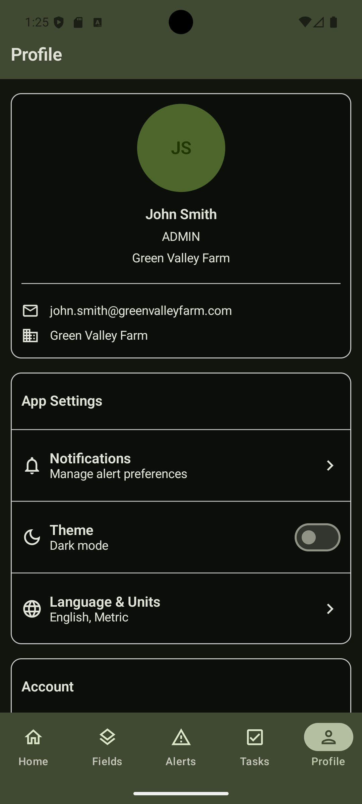 |

---

## Features

- **Dashboard** — farm-wide overview of field health, active sensors, open tasks, and alerts requiring attention.
- **Field monitoring** — tracks soil moisture, soil temperature, air temperature, air humidity, light level, and connectivity for each field.
- **Field status system** — fields are categorized as `HEALTHY`, `WARNING`, or `CRITICAL` based on sensor conditions.
- **Interactive map** — Google Maps view with field polygons and sensor markers; marker color reflects the current sensor or field status.
- **Statistics** — historical charts for Day / Week / Month periods, including raw and aggregated views for moisture, temperature, humidity, and lux values.
- **Alerts** — automatic threshold-based notifications with severity levels, current readings, thresholds, recommended actions, and links to related fields and tasks.
- **Task management** — create, edit, start, complete, cancel, and delete tasks; supports priorities, due dates, overdue detection, notes, and links to alerts and fields.
- **AI Assistant** — Gemini-powered chat that receives current farm context and provides field-specific recommendations based on sensors, alerts, and tasks.
- **Profile and settings** — account settings, theme mode, language, and measurement units.
- **Dark mode** — full light/dark theme support.
- **Offline-first behavior** — the app remains usable without network access; local changes are queued and synchronized once connectivity returns.

---

## Tech Stack

| Layer | Technology |
|---|---|
| Language | Kotlin |
| UI | Jetpack Compose, Material 3 |
| Navigation | Jetpack Navigation Compose, Bottom Navigation |
| Architecture | MVVM, Repository Pattern |
| Local Database | Room / SQLite, TypeConverters |
| Networking | Retrofit 2, OkHttp, Kotlinx Serialization |
| Maps | Google Maps SDK for Android |
| AI | Google Gemini API |
| Async | Kotlin Coroutines, Flow, StateFlow |
| Dependency Injection | Manual DI through `AppContainer` |

---

## Architecture

AgriStation follows an **offline-first MVVM architecture** with a clean separation between UI, domain/repository logic, local persistence, network synchronization, and external AI services.

```
UI Layer       →  Jetpack Compose screens + ViewModels
Domain Layer   →  Repository interfaces and app logic
Data Layer     →  Room local database + Retrofit/Ktor network layer + SyncManagers
```

A more detailed data flow looks like this:

```
UI (Compose screens)
    │
    ▼
ViewModels (StateFlow + combine)
    │
    ▼
Offline Repositories (Room)   ◄──── SyncManagers (background sync)
                                          │
                                          ▼
                                    Network Repositories
                                          │
                                          ▼
                                      REST API / Gemini API
```

### Key Architectural Decisions

- **Offline-first sync** — when the app is offline, user operations are saved locally and queued in pending-operation tables. They are replayed against the backend when the connection is restored.
- **Single source of truth** — the UI always reads from Room; the network layer only updates the local database.
- **Optimistic updates** — tasks and alerts are updated in Room immediately so the UI responds instantly, then synchronized in the background.
- **Cursor-based incremental sync** — endpoints such as `/fields/sync?since=<cursor>` return only changes since the previous sync. The client stores `nextCursor` and uses it on the next request.
- **Flow-driven UI** — repositories expose `Flow<T>`, ViewModels combine streams into `StateFlow<UiState>`, and Compose screens recompose automatically when data changes.
- **Aggregated history queries** — raw sensor history is stored in Room, while Week and Month statistics use SQL aggregation with `AVG(...) GROUP BY (...)` buckets.
- **Manual dependency injection** — dependencies are assembled in `AppContainer` without third-party DI frameworks.

---

## Project Structure

```text
app/src/main/java/com/example/agristation1/
├── data/                   # Local Room models, DAO classes, and repositories
│   ├── alertDetails/       # Alert entity, DAO, repository
│   ├── chatDetails/        # AI chat local models/history
│   ├── farmDetails/        # Farm data models
│   ├── fieldDetails/       # Field entity, DAO, repository
│   ├── historyDetails/     # Sensor history entity, DAO, repository
│   ├── sensorDetails/      # Sensor entity, DAO, repository
│   ├── taskDetails/        # Task entity, DAO, repository
│   ├── userDetails/        # User and farm entities
│   ├── AgriStationDatabase.kt
│   ├── AppContainer.kt
│   └── SyncOrchestrator.kt
├── network/                # API services and synchronization logic
│   ├── alertNetwork/       # Alert API, sync manager, pending operations
│   ├── fieldNetwork/       # Field API and history sync
│   ├── gemini/             # Gemini API client and prompt builder
│   ├── sensorNetwork/      # Sensor API and sync logic
│   ├── taskNetwork/        # Task API, sync manager, pending operations
│   └── userNetwork/        # User/farm API and sync logic
└── ui/
    ├── navigation/         # Bottom navigation graph and routes
    ├── pages/              # Compose screens
    ├── theme/              # Material 3 theme, colors, typography
    └── viewmodel/          # ViewModels for app screens
```

---

## Getting Started

### Prerequisites

- Android Studio Hedgehog or later
- Android SDK 26+
- Google Maps API key
- Gemini API key
- Running backend or mock server for demo data
- Node.js, if you use the included mock server

### Setup

1. Clone the repository:

   ```bash
   git clone https://github.com/bekaretzkaa/Agri-Station-v1.git
   cd Agri-Station-v1
   ```

2. Add API keys to `local.properties`:

   ```properties
   MAPS_API_KEY=your_google_maps_key
   GEMINI_API_KEY=your_gemini_api_key
   ```

3. If you are using the mock server of this project, start it:

   ```bash
   cd mock-server
   npm init -y
   npm install express
   node server.js
   ```

4. If needed, update the base URL in `AppContainer.kt` so the Android app points to your local or remote backend.

5. Build and run the project from Android Studio.

---

## Sync Flow

On first launch, when `lastSyncTime = 0`, the app performs a full synchronization and fetches recent field and sensor history. Later launches use incremental synchronization and request only changes since the last stored cursor.

```text
App start
    │
    ├─ lastSyncTime == 0 ──► Full sync: fields + recent sensor history
    │
    └─ lastSyncTime > 0  ──► Delta sync: only records changed since cursor
                                  │
                                  ▼
                         Store nextCursor locally
                         Upsert into Room
                         Emit updates to UI via Flow
```

Write operations follow an optimistic offline-first pattern:

```text
User action
    │
    ▼
Write to Room immediately  ──► UI updates instantly
    │
    ▼
Enqueue PendingOperation
    │
    ▼
SyncManager sends operation to backend
    │
    ├─ Success ──► Remove operation from queue
    └─ Failure ──► Retry on next sync cycle
```

---

## Database Schema

Room database with the main tables below:

| Table | Key columns |
|---|---|
| `field_details` | `id`, `farm_id`, `title`, `area`, `type`, `health`, `connectivity`, `lifecycle` |
| `history_details` | `id`, `field_id`, `recorded_at`, `soil_moisture`, `soil_temperature`, `air_temperature`, `air_humidity`, `lux` |
| `alert_details` | `id`, `field_id`, `type`, `severity`, `status`, `current_value`, `threshold`, `recommended_action` |
| `task_details` | `id`, `field_id`, `alert_id`, `title`, `description`, `priority`, `status`, `due_date` |
| `sensor_details` | `id`, `field_id`, `name`, `type`, `battery`, `state`, `latitude`, `longitude` |
| `field_points` | `id`, `field_id`, `point_order`, `latitude`, `longitude` |
| `alert_pending_operations` | `id`, `alert_id`, `operation_type`, `payload`, `created_at` |
| `task_pending_operations` | `id`, `task_id`, `operation_type`, `payload`, `created_at` |

Sensor history is pruned automatically on app start to keep local storage bounded.

---

## Development Stats

- Time spent: **80+ hours**
- Development period: **~1 month**
- Screens: **10+**
- Database tables: **8+**
- Synchronization modules: **5**
- Main focus areas: offline-first sync, Room aggregation queries, Google Maps integration, reactive Compose UI, and Gemini context prompting.

---

## What I Learned

This project helped me practice several production-style Android engineering topics:

- Designing offline-first synchronization with cursor-based pagination and a pending operations queue.
- Building reactive state management with `Flow`, `StateFlow`, `combine`, and `flatMapLatest`.
- Writing efficient Room queries for aggregated statistics over thousands of sensor readings.
- Rendering Google Maps polygons and sensor markers inside a Compose-based application.
- Building structured Gemini prompts from local Room data so the assistant can answer farm-specific questions.
- Handling Kotlin serialization edge cases such as nullable fields, defaults, and server response models.

---

## Demo Video

A 2.5-minute demo video is a good length for a README, but instead of committing a large video directly into the repository, the recommended approach is to upload the video as a GitHub asset, release asset, or external video link, then reference it here.

Example using a clickable thumbnail:

```md
[](https://github.com/YOUR_USERNAME/YOUR_REPOSITORY/assets/YOUR_ASSET_ID/demo.mp4)
```

Example using a direct video link:

```md
https://github.com/YOUR_USERNAME/YOUR_REPOSITORY/assets/YOUR_ASSET_ID/demo.mp4
```

For best compatibility, export the video as `.mp4` with the H.264 codec and keep the file size as small as possible.

---

## License

MIT License. See [LICENSE](LICENSE) for details.

This project was also built for educational purposes and as a portfolio piece for the Yandex School of Mobile Development application.


**AgriStation** is an offline-first Android application for real-time farm monitoring. It aggregates data from IoT sensors, tracks field health, generates alerts and tasks, and includes a Gemini-powered AI assistant that can analyze the current state of the farm and suggest concrete actions.

The project was built as a personal/portfolio Android project over **80+ hours** and focuses on practical offline-first architecture, reactive UI state, map-based field visualization, and AI-assisted decision support for agriculture.

---